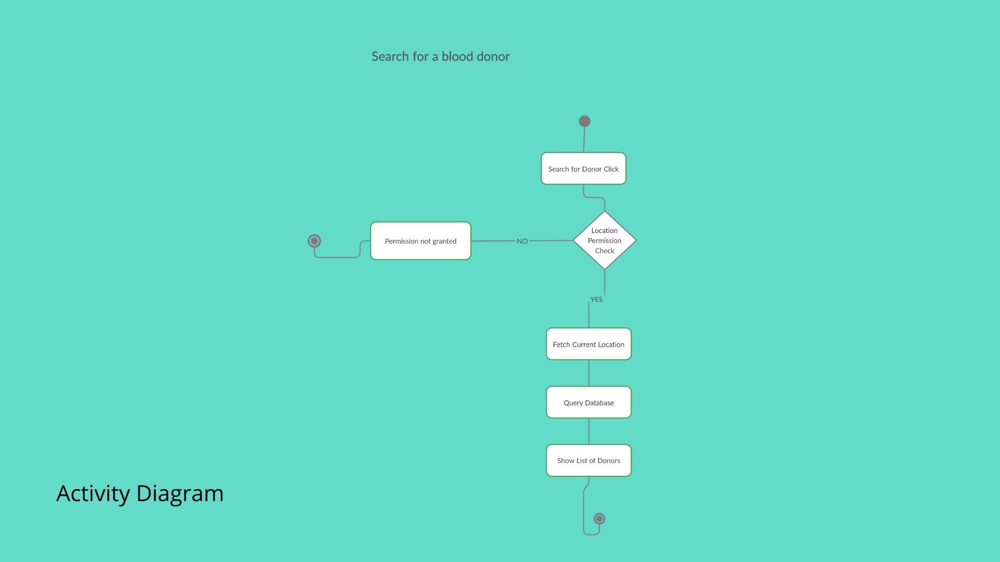
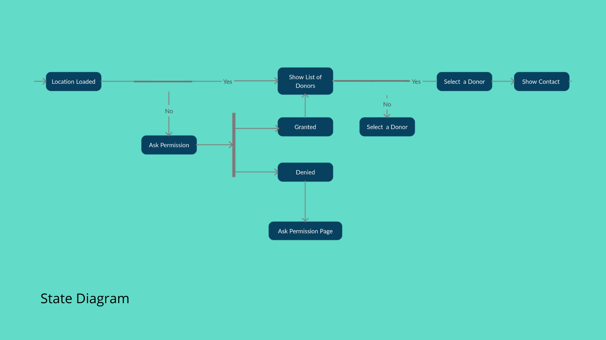
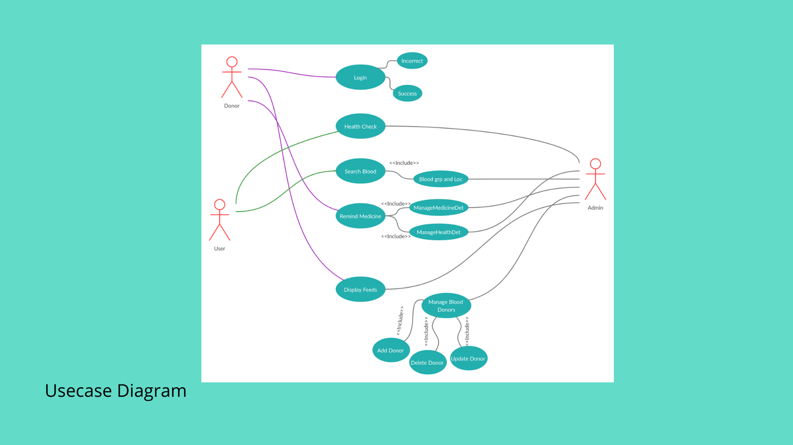
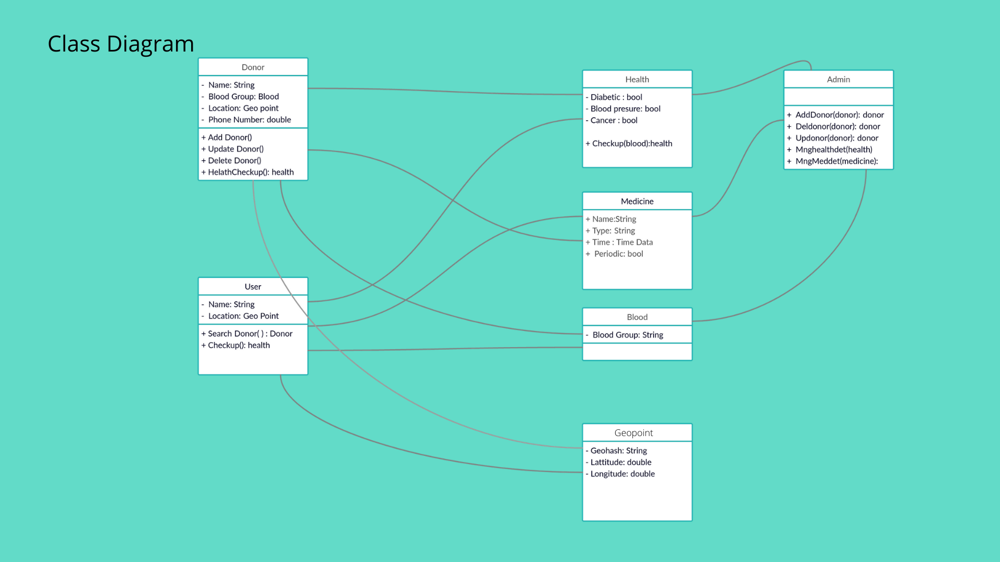
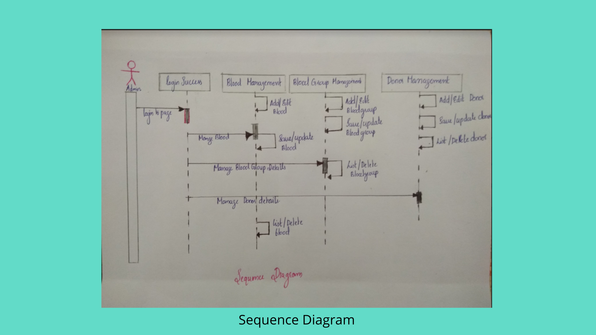

# Medcomai
Location based ai powered online blood bank platform along with health management. This is our **3rd year design project**, Fingers Crossed!

## Desccription
>Nowadays it is very hard to find a blood donor and specially if it is of some rare group. Keeping this as our problem statement we came up with an innovative way to solve this problem. All those who are willing to donate there blood can signup on our platform and there details along with the location will be taken as input and when somebody is in need of blood they can search with their location and blood group to get the list of donors. 
## Features
```
1. Register Blood Donor
  Donor(name, age, bloodgroup, location)

2. Search for a blood group
  Inputs(bloodgroup, location) 
  Output(List of Potential Donors in the ascending order of distance from the user lcoation)
  
3. Health Feeds
  Inputs(user checks)
  
4. Medicine timer
    Input(medicine,time,repeat or not)
    Output (Alarm on medicine taking time)
  
5. Suggestions
    Inputs(user checks)
```
## Activity Diagram


## State Diagram


## Usecase Diagram


## Class Diagram


## Sequence Diagram



## Tech Stack
### Backend
  Firebase
### Frontend
  Flutter.dev
### Additional Frameworks Used
  *will be mentioned later*


## Group 8, Medcomai
1. Jose Francis 
2. Remya Elizabeth Chacko
3. Robert K Samuel
4. Sijo M Thomas


